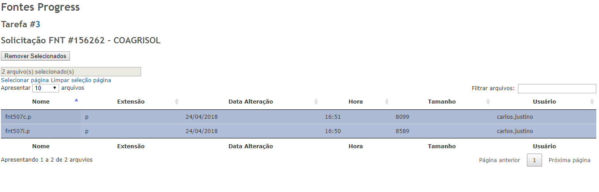
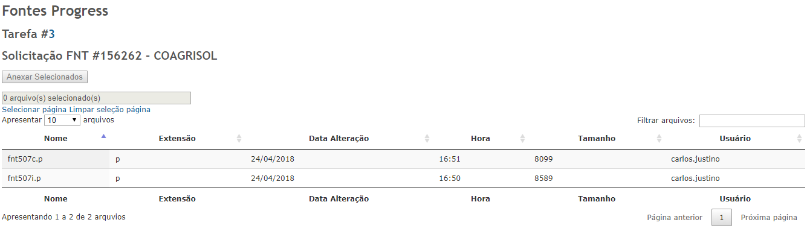
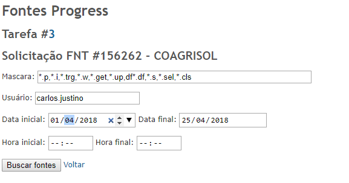

## Datacoper - Redmine Plugin - Anexos do Progress

Este plugin faz a integração com o FNT(Progress).

## Funcionalidades

### Fontes

##### Apresentação e anexo dos fontes na solicitação referenciada no REDMINE.
##### Criação de uma nota privada com os fontes que foram anexados ou removidos.
##### Criação de uma ocorrencia com esta mesma movimentação no FNT.

1. Botões adicionados nas Tarefas

     

2. Dados dos arquivos a serem apresentados
    - Nome do Arquivo
    - Usuário que criou o arquivo
    - Data de ultima alteração
    - Tamanho
    - Extensão

    

    

3. Filtro para buscar os fontes na base do cliente
   - Por data
   - Por hora
   - Por usuário
   - Por extensão/nome

    

### Controle de permissão

- Visualizar anexos
- Remover anexos
- Adicionar Anexos

## Installation notes

1. Baixe a ultima versão do plugin [ultima versão](https://github.com/carlosjustino/redmine-fntprogress/releases/latest).
2. Extraia dentro da pasta `<redmine_path>/plugins`. O resultado deve ser `<redmine_path>/plugins/fntprogress`.
3. Executar a migração do banco.
   
   `bundle exec rake redmine:plugins:migrate`
   
4. Reinicie o Redmine.

Agora você conseguira ver o plugin na lista no caminho _Administration -> Plugins_ e poderá configura-lo.

Antes de utilizar, deve ser feita a configuração, registrando o `Endereço` e a `porta` na qual o servidor do `FNT` estará escutando.

Informações sobre Instalar e Desinstalar plugins no Redmine pore ser encontrado em [Redmine Plugins page](http://www.redmine.org/projects/redmine/wiki/Plugins).

### Dependence

- Existe a dependencia dos campos customizados:
    - Cliente
    - Solicitação FNT

### Compatibility

- Redmine 3.0
